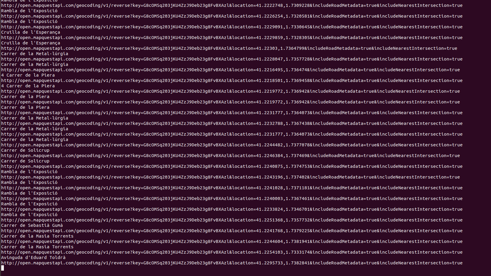
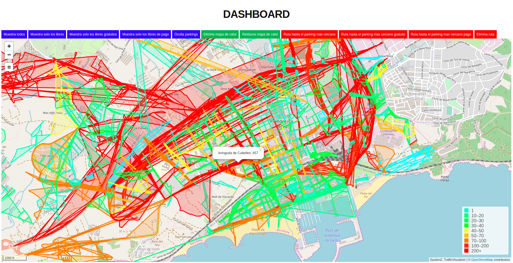
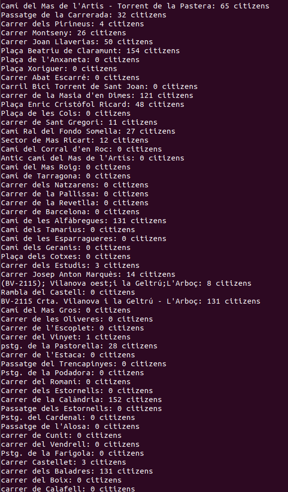

# DATA PARSING

After all the mess generating all this raw data it's always useful to know which available options do we have for analyzing everything. At the moment, this is what can we analyze from a city:

1. Traffic congestion at any given moment of the day (in the scripts you'll find how to compute it at each hour but you'll be able to change it as you wish)
2. Compute how many people are in each neighborhood (__not done but it's on my roadmap__)
3. Compute how much noise is generated at each zone of the city (__not done but it's on my roadmap__)

## Requirements

In this process we'll be using the following libraries:

	- pyosmium: python3 
	- osmfilter: cmd tool

### Download raw map file

To parsing all this data, first we'll need to obtain the raw OSM (Open Street Map) of our city. In order to obtain it, make this request:

https://overpass-api.de/api/map?bbox=x1,y1,x2,y2

Where x1,y1 are lattitude,longitude. Note that this two coordinates represent the __TopLeft__ and __BottomRight__ of the bounding box map you want to download. In order to know which is the correct bounding box head to https://www.openstreetmap.org/export and copy the coordinates. I told you to use overpass-api as big maps can not be downloaded directly from OSM.

Call this file __city.osm__ (.osm format needs to be specified for pyosmium parser afterwards) and save it into cityinfo/ directory.

## Parse streets

In order to parse streets you'll have to first create a Mapquest account https://developer.mapquest.com and place your API KEY on compute_congestion_per_street.py as we'll using their services. To execute it do the following:

```
python3 compute_congestion_per_street.py cityinfo/city.osm
```



After generating it, we'll be able to visualize the limits that are generated with another tool I've done in the past in https://github.com/EpsilonZ/TrafficVisualizer (at the moment don't care about the congestion, just see the shapes of the streets). 



## Getting the congestion

In order to compute the congestion for the whole generated, you'll have to do the following:

```
python3 compute_congestion_per_street.py ../GenerationModule/sampleResultTraces/samplegittracegps cityinfo/city_street_limits.txt
```
Note that ../GenerationModule/sampleResultTraces/samplegittracegps will be your trace generated file



__NOTE__: This computing of congestion per street is something I'm still working. If you execute it you'll note that not all citizens are computed of the simulation. This is because some citizens are not within any street boundaries so what I'll have to do is compute to where is the nearest one.

## ADDITIONAL INFO FOR YOU ON HOW MAP PARSING WORKS. THIS IS JUST ONLY FYI, IS NOT REQUIRED TO PARSE WITH THIS TOOL

### Download pbf from Geofabrik

Head to Geofabrik (__they are huge, thank you for your amazing work__) http://download.geofabrik.de/ and download your pbf file. In my case it'll be __spain-latest.osm.pbf__.

### Download raw map file

To parsing all this data, first we'll need to obtain the raw OSM (Open Street Map) of our city. In order to obtain it, make this request:

https://overpass-api.de/api/map?bbox=x1,y1,x2,y2

Where x1,y1 are lattitude,longitude. Note that this two coordinates represent the __TopLeft__ and __BottomRight__ of the bounding box map you want to download. In order to know which is the correct bounding box head to https://www.openstreetmap.org/export and copy the coordinates. I told you to use overpass-api as big maps can not be downloaded directly from OSM.

Save it into cityinfo/ directory.

### Download raw polygon file

Head to https://github.com/JamesChevalier/cities and download your polygon raw file and save it into cityinfo/ directory. In my case it'll be vilanova_i_la_geltru.poly (it's in https://github.com/JamesChevalier/cities/blob/master/spain/catalun%CC%83a/vilanova-i-la-geltru%CC%81_catalun%CC%83a.poly)

### Generate all the available info of our city

osmosis --read-pbf-fast spain-latest.osm.pbf file="spain-latest.osm.pbf" --bounding-polygon file="vilanova_i_la_geltru.poly" --write-xml file="cityinfo.osm"

### Generate all streets info from this test.osm

osmfilter test.osm --keep="highway=*" --drop-version > vilanovastreets.osm

__Note__: If you want only the list without any repetition:

```
cat vilanovastreets.osm | sort -u | grep name
```

## In case you want additional info about how to parse raw maps

(You'll need to install osmfilter tool to do the following)

Once you've downloaded there are some things you can do it on your own. Think this raw map as a xml representation of what OSM shows you. So, for example, you can do the following to obtain parking zones:

```
	osmfilter cityMap.osm –keep="parking*=* o=parkingzonesOutput.osm

```

Where cityMap.osm is the raw downloaded map file from overpass-api and the parkingzonesOutput.osm is the extracted file with all the parking zones found.

Or, another example, if you want all leisure areas:

```
osmfilter cityMap.osm --keep="amenity=bar =restaurant =bbq =biergarten =cafe =ice_cream =pub =library =casino =cinema =community_centre =gambling =social_centre =theatre =bench =dojo =dive_centre =grave_yard =market_place =public_bath =table =car_wash =food_court" -- ignore-dependencies -o=leisureareasOutput.osm
```

Where cityMap.osm is the raw downloaded map file from overpass-api and the leisureareasOutput.osm is the extracted file with all the leisures areas found.
