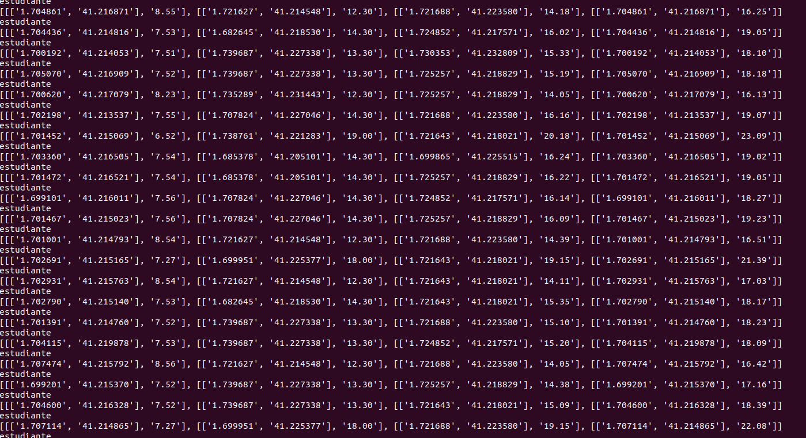
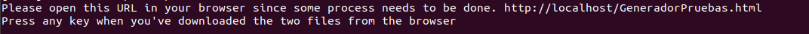
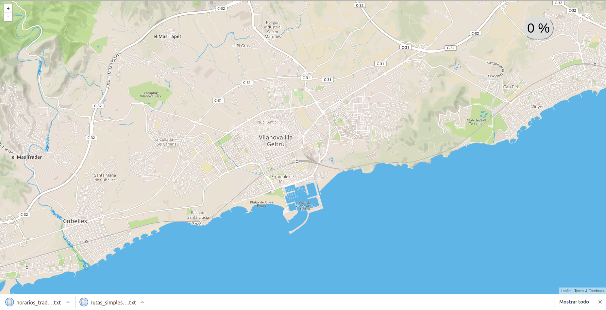

# City generation

## REQUIREMENTS

To execute this you will need to have set up an OSRM server since this is the server we'll use to generate routes. It uses a really simple API so it'll be perfect for our use. Please head to:

Docker: https://github.com/Project-OSRM/osrm-backend/wiki/Docker-Recipes (__This is what I've built so if you go for it I can help you__) 

Non-docker: https://github.com/Project-OSRM/osrm-backend

AWS: You can use their cloudformation template from https://github.com/Project-OSRM/osrm-backend. Be aware that this requires an AWS account and it might exceed free tier usage.

You also will need the latest version of Chrome. __Other browsers have not been tested.__

## JSON Configuration

JSON configuration will have the following structure:

```
{
  "name": "Vilanova random",
  "description": "JSON configuration test",
  "numberOfCitizens" : 5,
  "visualizationTracing" : true,
  "gpsTracing": false,
  "traceName": "vilanovaRandom1",
  "downloadsBrowserFolder": "/home/epsilon/Descargas",
  "osrmServerIP": "54.229.190.29",
  "osrmServerPort": "5000",
  "destinationDirectory": "/var/www/html/Data/"
}
```
Which, each of them represent the following:

__name__: Name of the simulation.

__description__: A description of the simulation. This helps keeping a record of what's inside each simulation

__numberOfCitizens__: The % of the city you want to generate. 100 is the total.

__visualizationTracing__: True if you want to generate the city and enable visualization to the data false if not.
 
__gpsTracing__: True if you want to generate GPS database of all citizens during all the day

__traceName__: Name of the files you'll be generating

__downloadsBrowserFolder__: This is really useful as we'll be getting data from downloaded files from our web application so it's important that you configure it correctly or you'll encounter errors when looking for files

__osrmSeverIP__: IP for the OSRM server. I've enabled one for you to test!. IP is __54.229.190.29__

__osrmServerPort__: Port for the OSRM port listening. Typically OSRM runs on 5000

__destinationDirectory__: Where do you want to save all data generated

## How to execute it

```
sudo python3 GJsonConfigParser/parse_json_config.py --jsonConfig config.json
```

__NOTE__: THIS CAN TAKE A LOT OF TIME DEPENDING ON THE CITY SIZE. IT'LL END UP WORKING, JUST BE PATIENT AS A LOT HAS TO BE COMPUTED! 

For illustration, this is GJsonConfigParser/parse_json_config.py will do automatically (watch out for step 2, this is the only step that needs your input):

1. Create scheduled routes. When creating scheduled routes you will see this image:

 

2. Download translated GPS points to Canvas points from your localhost webpage you've set up. You will have to manually enter the http://localhost/GeneradorPruebas.html to manually start to execution. Once this is done you will be free to close the browser and keep the execution. Program will automatically copy the generated files to your current directory.

 

__NOTE: If you see that an error occured downloading just refresh the page and delete the temporary downloads from your Downloads folder__

3. Create smoother paths. Since doing this at browser is an issue, I wanted to execute this locally.

 

4. Execution to file. This will take some time so please be patient...

5. Generate heat map.

6. Unify heat map and execution file to boost performance on visualization and analytics.

7. Generate line sizes

8. Move the needed files to /var/www/html/Data for you to be available to visualize them at http://localhost/SimulacionFinal.html

If during the process you've had a RAM issue you can go to GSmootherPath/genera_intermedios.py and change this line:

```
                                puntosIntermedios = 10
```
__To a lower number. This will result in a less intermediate points so less smoothing is applied to the route.__
__You can always mount a temporary higher swap to execute this__

## Visualizing results

Once you have generated your city you can travel to http://localhost/SimulacionFinal.html to watch your simulation. Be aware that you'll have to select it through the interface on http://localhost/SimulacionFinal.html clicking on "Seleccionar archivo" and navigating to /var/www/html/Data directory. 

Also, if you want to analyze your traces, go to https://github.com/EpsilonZ/TrafficVisualizer and copy your generated file (no need to include sizes.txt) there to further analysis.


## TROUBLESHOOTING

This section is made of errors I've been encountering and maybe if you change it you may encounter them as well so take a look at them if you modified the source code.

ValueError: could not convert string to float: '\ufeff541'. When generating schedules file a character is added to the beggining.
