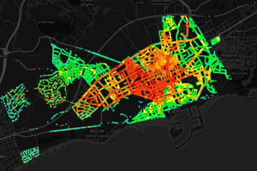
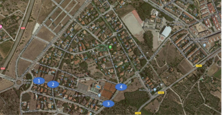
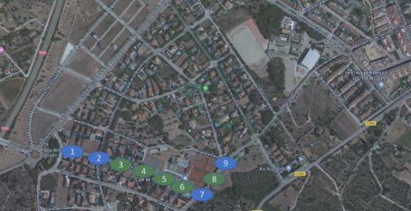
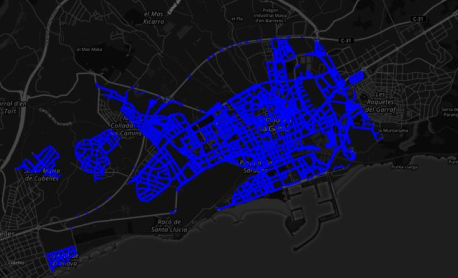
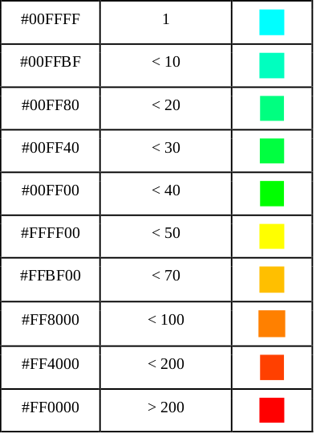
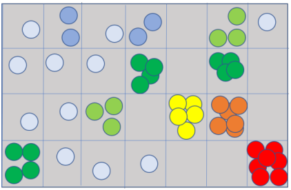

# CityVisualizer 1.0

__AT THE END I HAVE A ROADMAP IN ORDER TO LET YOU KNOW WHAT I'M CURRENTLY DEVELOPING!__

__Note: If you want to setup your environment head to code/ and html/ directory. There you will find step by step explanations!__

__Note2: I hope this README is helpful for you. If it is not please open an issue explaining what part you don't quite understand and I'll be pleased to help!__

__Note3: We'll use Mapbox. Mapbox has a free tier usage, so, if you want to implement this, head to https://docs.mapbox.com/help/how-mapbox-works/access-tokens/ and learn how to create your own API Key. You will have to place that API Key on the html files that create a map__

__Note4: I would love to upload sample files for you to visualize but each generated city can get up to 13GB so uploading this to GitHub is impossible. As soon as I find a way to attach them I'll__

__Note5: Under code/ directory you will find a pdf presentation of the project in Spanish__

__Note6: This project has another project that was created from it to analyze Traffic and Parking (trying to replicate Google Maps). Check this out if you are interested. https://github.com/EpsilonZ/TrafficVisualizer__

CityVisualizer have been designed to visualize and simulate urban movements really easily knowing a series of interest of points. 

 
 
 Before continuing, please watch the sample video to have in mind what this is so it's easier for you to follow the explanations https://www.youtube.com/watch?v=UivN9joTPaI&t=. Note that what you see is only the front-end of the application!

This simulator is based on ABM (Agent Based Modelling) which basically means that in order to simulate a well structured city we have to know how each of our citizens behave within the city. 

Let's take this for an example:
 
  1. We wake up at 7:30 AM to go work
  2. We leave our house at 8:30 AM 
  3. We take a route to hour workplace (car/walking/cycling). We arrive at 9:00AM
  4. We leave work to eat home 2:30PM
  5. After we eat we go to the park. We leave at 5:00PM 
  6. We go go home at 7:30PM and we reach home at 9:00PM

So, with this information, scaling to all of the citizens, we would be able to provide precise simulations and visualizations. Also, as an extension to this project, we'll add a module where you will be able to visualize traffic at each hour at each street which will simulate Google Traffic.

Before starting, you will find a document called __ArtTFG.pdf__ which will contain a in-depth explanation of this project as this was my Bachelor's final project. Bare in mind it's in __Spanish__! Anyway, for those who don't speak Spanish, you will have a detailed explanation here too!

CityVisualizer consists in a series of sequential modules that each of them have a function to do:

__Source data.__ This is really important as you want to make your city simulation to have a sense of realism. Bare in mind that the more you work on your source data the better result you have. In my case I've used Vilanova i la Geltrú public information to develop this. You will find the source data at the sourceData/VilanovaILaGeltru directory. Note that the directory is a set of files, which, for each of them, I extracted a set of information needed for the simulation (on the generation you will see the required info). Also, public government web pages are good as more countries are heading for opendata so you might want to check them out! For example, in my city: http://opendata.vilanova.cat/

 __1. CityScheduledRoutesGenerator.__ This will take all the information of our city and generate a real city day according to this information. See the following for an example of data:
 
 ```
 workplaceGPSCoordinates = [[1.696801,41.224012], [1.701366,41.215391], [1.699993,41.225366],[1.721580,41.214520],[1.739690,41.227335],[1.682698,41.218490],[1.685359,41.205092],[1.735355,41.231337],[1.738789,41.221267],[1.707761,41.226915]]

workSchedules= [[6.20,14.00],[9.00,15.00],[7.30,18.00],[9.00,12.30],[8.00,13.30],[8.00,14.30],[8.00,14.30],[8.30,12.30],[7.00,19.00],[8.00,14.30] ]

schoolsGPSCoordinates = [[1.698466,41.225163],[1.690294,41.221331],[1.699993,41.225366],[1.721580,41.214520],[1.739690,41.227335],[1.682698,41.218490],[1.685359,41.205092],[1.735355,41.231337],[1.738789,41.221267],[1.707761,41.226915]]

schoolSchedules = [ [9.00,17.00],[9.00,15.00],[7.30,18.00],[9.00,12.30],[8.00,13.30],[8.00,14.30],[8.00,14.30],[8.30,12.30],[7.00,19],[8.00,14.30] ]

agesPerSchoolCenter = [[0,24],[3,11],[3,11],[3,11],[3,16],[3,18],[3,21],[11,21],[11,24],[18,24]]

numOfPeoplePerAge=[549,571,558,681,698,705,713,785,729,732,696,746,754,684,649,706,669,598,642,615,575,618,569,668,631,666,653,641,\
667,660,711,802,827,852,893,1000,990,1094,1186,1165,1178,1176,1174,107,1114,1109,1086,1087,1136,1051,1083,1063,995,955,932,\
942,966,932,910,857,780,800,786,762,673,700,733,694,627,633,569,573,575,505,450,547,355,383,478,460,456,387,389,380,348,352,239,247,172,203,126,110,84,76,55,33,16,18,9,7,9]

unemploymentRate = 0.1181

```
Now, with this information, our program will be able to generate a route for EACH of our citizens according to the age and if he/she's employed! Here's an example of a GPS route generated:

__Route file__

```
[[1.700928,41.214359],[1.701721,41.214692],[1.701561,41.214748],[1.701322,41.215451],[1.701297,41.2161],[1.702157,41.217756],[1.701312,41.218047],[1.702504,41.219422],[1.700852,41.220596],[1.701125,41.222647],[1.700374,41.222804],[1.700445,41.223113],[1.699608,41.223161],[1.699784,41.225025],[1.698466,41.225163],[1.698466,41.225163],[1.699784,41.225025],[1.699663,41.224722],[1.702169,41.224722],[1.704546,41.224911],[1.705957,41.225477],[1.707214,41.225655],[1.707936,41.225447],[1.709301,41.223771],[1.716277,41.227197],[1.718652,41.228135],[1.721533,41.229506],[1.723094,41.230104],[1.724621,41.230354],[1.724812,41.230488],[1.724533,41.231705],[1.725785,41.232042],[1.72577,41.232167],[1.725929,41.232186],[1.725776,41.233154],[1.727194,41.233203],[1.727451,41.233426],[1.728427,41.233572],[1.730159,41.234225],[1.730441,41.235022],[1.731287,41.23603],[1.731556,41.236589],[1.732223,41.236543],[1.732943,41.235415],[1.732729,41.233022],[1.732834,41.232276],[1.732591,41.231917],[1.731825,41.231842],[1.731585,41.232102],[1.730758,41.232427],[1.730906,41.232556],[1.73138,41.232552],[1.73138,41.232552],[1.730758,41.232427],[1.731825,41.231842],[1.732591,41.231917],[1.732834,41.232276],[1.732943,41.235415],[1.732223,41.236543],[1.731556,41.236589],[1.730159,41.234225],[1.727194,41.233203],[1.725776,41.233154],[1.725929,41.232186],[1.724533,41.231705],[1.724621,41.230354],[1.722607,41.22996],[1.716942,41.227504],[1.705437,41.221761],[1.702751,41.219301],[1.70338,41.218918],[1.702677,41.218418],[1.701584,41.216847],[1.701261,41.215773],[1.701721,41.214692],[1.700928,41.214359],['1.700928', '41.214359']]
```

And, with that route, a schedule generated to the route of the citizen:

__Schedule file__

```
1.700928 41.214359 8.40 1.698466 41.225163 17.00 1.731380 41.232552 18.01 1.700928 41.214359 20.32
```
Where it follows the following schema:

```
lat1 lon1 hourToLeave1 lat2 lon2 hourToLeave2 lat3 lon3 hourToLeave3 ...... latN lonN hourToLeaveN
```

__NOTE1:__ In the code I provide you will find a parallel version (coded in C) and a sequential version with Python.
__NOTE2:__ For this step you will want to set up a custom OSRM server or use the public one (it has down times and throtle limits). Please, head to OSRM github repo and follow their instructions! Once you've set up that, you will only have to change the OSRM IP to yours!

__2. RouteSmoother.__ When doing requests to a route generator (for example OSRM, which will be the one we'll be using) a set of GPS coordinates are returned. But, this GPS coordinates aren't a smooth path to your destination but a change to the path.
For example, look at this image:

  
 

On this image we see a real returned GPS route that OSRM provided us with an origin and an ending. We can immediatily can see that if we want to visualize something with this we'll have to enrich the data that we received. What we'll do is create intermediate points to create a smooth path:

 
 
 Also, as you can see at the image, you will see that blue style on the image. I used that to indicate that on this step we'll also do is traduce GPS points to Canvas points to visualize afterwards. That's required because the tool we'll be using to visualize requires Canvas points and __translating points each time we visualize is a really bad idea, it's better to pregenerate them and then visualize all the times we want smoothly!__. So, taking the examples from step 1, here's what our files will look like.
 
 __Route file__
 
 ```
 583 536 580.75 534.75 578.5 533.5 576.25 532.25 574 531 573.75 531.25 573.5 531.5 573.25 531.75 573 532 572.5 531.5 572 531 571.5 530.5 571 530 571 529.5 571 529 571 528.5 571 528 566.5 523.75 562 519.5 557.5 515.25 553 511 553.75 503 554.5 495 555.25 487 556 479 553.75 478.25 551.5 477.5 549.25 476.75 547 476 547.25 475 547.5 474 547.75 473 548 472 545.5 471.75 543 471.5 540.5 471.25 538 471 538.5 463.75 539 456.5 539.5 449.25 540 442 536.25 441.5 532.5 441 528.75 440.5 525 440 528.75 440.5 532.5 441 536.25 441.5 540 442 539.5 449.25 539 456.5 538.5 463.75 538 471 540.5 471.25 543 471.5 545.5 471.75 548 472 547.75 473 547.5 474 547.25 475 547 476 549.25 476.75 551.5 477.5 553.75 478.25 556 479 555.25 487 554.5 495 553.75 503 553 511 557.5 515.25 562 519.5 566.5 523.75 571 528 571 528.5 571 529 571 529.5 571 530 571.5 530.5 572 531 572.5 531.5 573 532 573.25 531.75 573.5 531.5 573.75 531.25 574 531 576.25 532.25 578.5 533.5 580.75 534.75 583 536 586 533.75 589 531.5 592 529.25 595 527 593 524.5 591 522 589 519.5 587 517 587.25 516 587.5 515 587.75 514 588 513 592.5 508 597 503 601.5 498 606 493 608.75 490.25 611.5 487.5 614.25 484.75 617 482 645.75 463.5 674.5 445 703.25 426.5 732 408 739 404.5 746 401 753 397.5 760 394 768.25 388.75 776.5 383.5 784.75 378.25 793 373 800.5 370 808 367 815.5 364 823 361 827.5 360.75 832 360.5 836.5 360.25 841 360 842.5 360.5 844 361 845.5 361.5 847 362 847.75 361.5 848.5 361 849.25 360.5 850 360 858.75 359.25 867.5 358.5 876.25 357.75 885 357 885.75 357.25 886.5 357.5 887.25 357.75 888 358 889 357.25 890 356.5 891 355.75 892 355 903.25 353.5 914.5 352 925.75 350.5 937 349 939.25 348.25 941.5 347.5 943.75 346.75 946 346 944 346.75 942 347.5 940 348.25 938 349 926.5 350.5 915 352 903.5 353.5 892 355 891 355.75 890 356.5 889 357.25 888 358 887.25 357.75 886.5 357.5 885.75 357.25 885 357 876.25 357.75 867.5 358.5 858.75 359.25 850 360 849.25 360.5 848.5 361 847.75 361.5 847 362 845.5 361.5 844 361 842.5 360.5 841 360 836.5 360.25 832 360.5 827.5 360.75 823 361 815.5 364 808 367 800.5 370 793 373 784.75 378.25 776.5 383.5 768.25 388.75 760 394 753 397.5 746 401 739 404.5 732 408 703.25 426.5 674.5 445 645.75 463.5 617 482 614.25 484.75 611.5 487.5 608.75 490.25 606 493 601.5 498 597 503 592.5 508 588 513 587.75 514 587.5 515 587.25 516 587 517 589 519.5 591 522 593 524.5 595 527 592 529.25 589 531.5 586 533.75
 ```
 __Schedule file__
 
 ```
 583 536 8.40 525 440 17.00 584 536 18.01 944 342 20.32
 ```
 
 
 __3. ExecutionToFile.__ In this step we'll do an standard execution as we would do visualizing it. The way it works it's really simple. We increase time of the day, we look __Schedule file__ and __Route file__ and we check for EACH user if the point the citizen is in the __Schedule file__ and if needs to wait until the hour to leave. To make things clearer look at the following example:
 
 Initial situation
 
 Cit1 is at home and leaves at 7:31 AM
 Cit2 is in his way to work 
 Starting simulation hour is 7:29 AM 
 
 Execution starts:
 
 ```
 
 Algorithm runs (is 7:29 AM)
 1. Check cit1 status. We see that is in his house and until 7:31 he can't leave. Write the point to the result file.
 2. Check cit2 status. Go to the next point of your route. Write the point to the result file
 Algorithm runs (is 7:30AM)
 1. Check cit1 status. We see that is in his house and until 7:31 he can't leave. Write the point to the result file.
 2. Check cit2 status. Go to the next point of your route.
 Algorithm runs (is 7:31AM)
 1. Check cit1 status. We see that is in his house and until 7:31 but now he can leave to work!. Write the point to the result file.
 2. Check cit2 status. Go to the next point of your route. Write the point to the result file
 
 ```
 
 __So, our results file will have for EACH time of the day EACH position!__
 
 But, remember, we want to keep things low at runtime so we do a few optimizations before visualizing. Here's a list of optimizations we'll do to our data:
 
 3.1. We will transform the data matrix. At the moment, as we've seen on the step 1 and step 2 the structure of the Route generated file is a line per route in our generated file. Well, because we will simulate this on a Browser, we have to bare in mind that resources and limited and therefore we have to rethink this structure. That's why what we'll do is the following:
 
 __Route file__:
 
```
  CanvasPointXCitizen1 CanvasPointYCitizen1 CanvasPointXCitizen2 CanvasPointYCitizen2 ..........
```

And, with this way, we'll be able to set up an environment where we can program a chunk by chunk ingester to the browswer in order to not collapse. Note that the traces we'll generated are the order of 13GB for a city of 70K people so if you scale that up it gets really heavy!

3.2 With the execution result we no longer need the __Schedule file__ as we've used to execute! Once we've done it, we got where user is at each second of the day!

3.3. With the execution file we've made we will do a beautiful heatmap. What does a heatmap provides us is an amazing feature to understand how people concentrate at each zone of the city. Look at the following images to understand the difference:

Here's a capture with no heat map:

 
 
 Here's a capture with heat map:

 

To generate this heatmap, at EACH step we'll generate a matrix with a set of boxes which will represent subdivisions of our city. Each box will have a score (number of citizens inside) and, with that score, we'll assign a hexadecimal code to each citizen (after we'll see a optimization to this) which will represent a colour. This colour, at runtime, will be changed each step to represent the congestion of the zone. This is the heatmap table we'll follow (you will be able to change it as you want!):

 

So, to summarize this, here's an example of assigning a colour according to the score of the box:

 
 
 So, to make things clearer, our Route Canvas file which we generated with the ExecutionToFile a color will be attached to each citizen at each step. This will look like the following:
  
```
  CanvasPointXCitizen1 CanvasPointYCitizen1 ColorCitizen1 CanvasPointXCitizen2 CanvasPointYCitizen2 ColorCitizen2 ..........
```

3.4. When we talk about cities and smart mobility a thing comes to our mind. Monitoring the traffic of the urban areas. That's where this step takes place. With the execution file we can execute programs taking this data to analyze and take results. See a sample Django App I made to visualize all of this in an interactive front-end where you have a map with the traffic per street (and also parking)! https://github.com/EpsilonZ/TrafficVisualizer.

__IMPORTANT 3.5.__ Here we'll do a really simple step but a really important one to boost the performance of our application. What we'll do is the following:

1. Take the Route file with the heatmap we've done at 3.2 
2. Compute the size of EACH line and generate a file with all line sizes (in bytes). For example:

```
1104152
1104152
1115389
1114095
1121855
1114895
1126350
1124393
```
3. With this file, we'll be able to tell our application what to read at each moment so we securely say that we only use the memory we need and we don't collapse our application. This will be also important to securely say this is __scalable__.

__4. Visualization.__ Because the architecture was well thought, this step is really simple. Just import the generated file with the heatmap and visualize ALL THE TIMES YOU WANT SMOOTHLY! For visualizing you will also need to provide the file and that's it!


The way it works is the following:

1. Get time of day
2. We take __Line sizes__  generated file at step 3.5 and get the exact size of that time of the day
3. We load that chunk of data from our __ExecutionToFile__ generated file
4. We visualize it
5. Go to next time of day (next minute for example)
5. Go to 1 until all citizens finished routes

__4.1 NOTE.__ As I mentioned before at 3.2 (__we'll assign a hexadecimal code to each citizen (after we'll see a optimization to this) which will represent a colour__) we can do a optmization too here at runtime! But before heading up to the optimization, let's think about something:

1. When we have 200 stacked people do we REALLY need to visualize ALL of them?
2. When we have 100 stacked people do we REALLY need to visualize ALL of them?
3. And this goes on and on

That's why, when testing the application, I thought about something. Why not show a percentage of the total depending on the congestion? So that's what I did. Some pseudocode to understand this

```
if RED:
   if probability(0.75): //this returns true if our random number function is within the 0.25 zone
       visualizeCitizen
if GREEN:
   if probability(0.5): 
       visualizeCitizen
```

And this goes on and on! 

__Note that this could be done at 3. step before executing adding labels to the citizens to not visualize it but this doesn't affect much the execution!__ Also, note that because the assigning of not visualizing and visualizing each step varies so at the congested zones you might see sort of blinking!

Our visualization application will have the following features:

 1. __Faster__. This will accelerate the day we're simulating.
 2. __Slower__. This will decrease the speed of the day we're simulating.
 3. __Bigger__. This will make citizens bigger so we have another view of the situation.
 4. __Smaller__. This will make citizens smaller.
 5. __Move forward in time__. This will travel forward in time.
 6. __Move backward in time__. This will go back in time
 
 Note that all of this options are easy to change so please change as you wish.  

# ROADMAP

- Enable an API where users can request an hour and a city and congestion is given (this only will be applied to the city I'm testing all of this)

- Compare simulated data to real data with Google Traffic and real measurements

- Integrate this tool with other sensor data (I'm currently doing a M.S in IoT so I'll be probably use this tool with the project)

- Enable an API where an origin and destination are given and for each street the congestion is given for the time of the day (I've actually done this already but it's from another project. I'll have to merge it somehow)

- Enable a Docker where users can launch everything with no need to install it in their OS. This will be great as it can be moved to any Server or even to AWS instances with no need of setting up the env!

- Enable interaction with the visualizer. Zoom, move around the map, etc

- Enable classification of the elements. Students/workers/unemployed/>10yo/etc. Will have to look at what's more interesting

- Enable to filter between static citizens (staying at their homes, school or anywhere) and citizens in their route to somewhere
